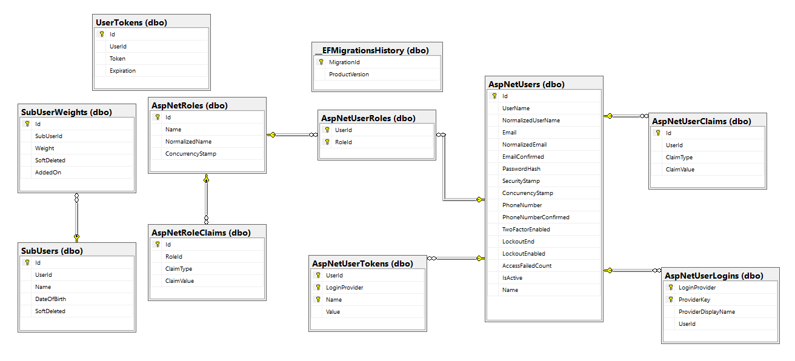
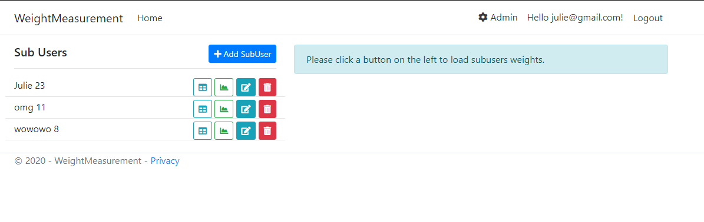
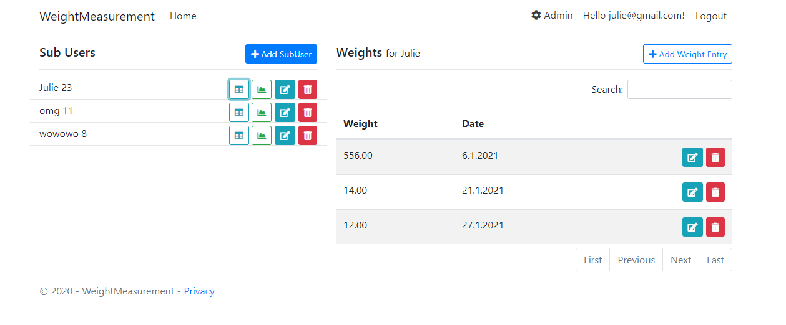
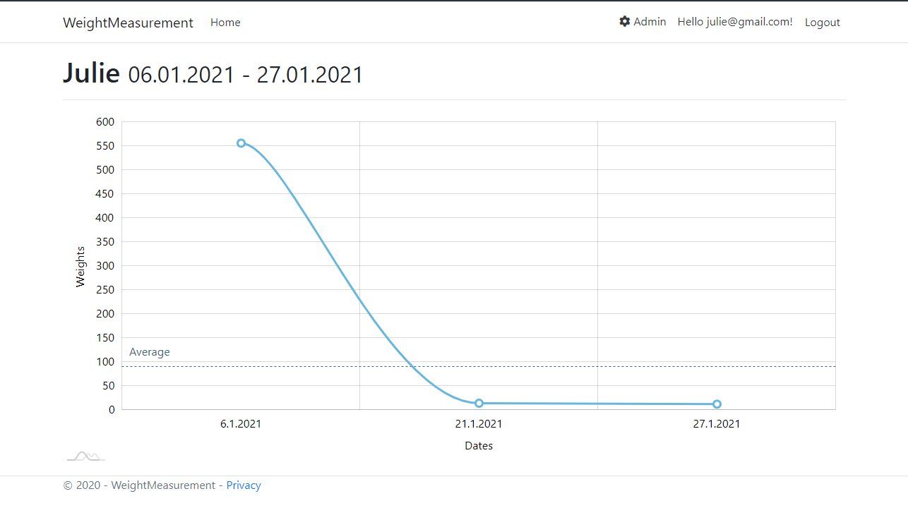
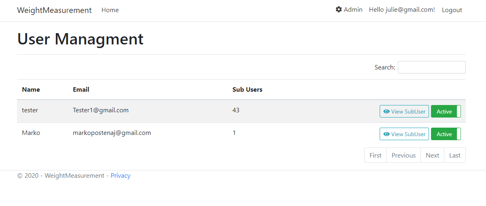
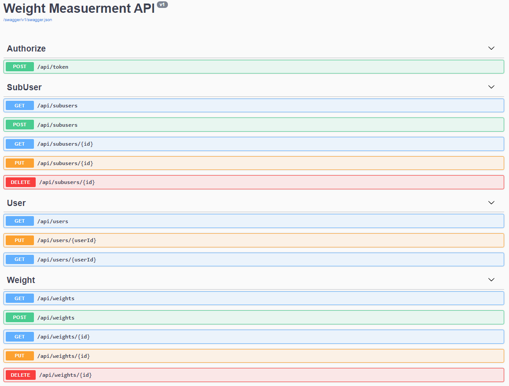
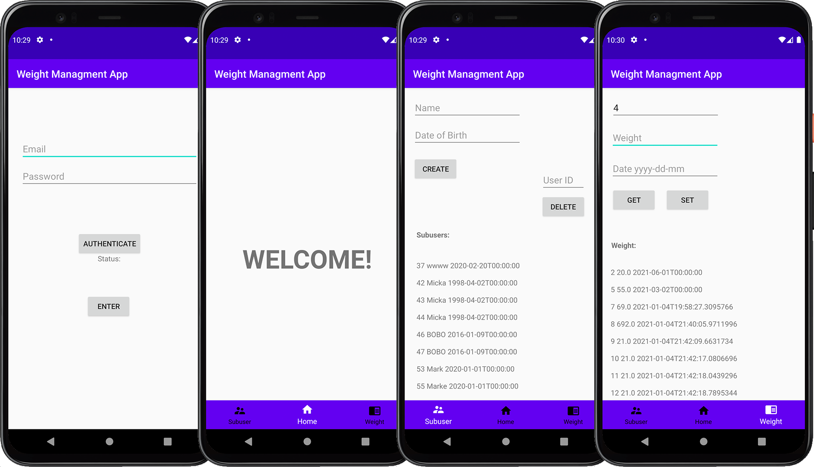

# Weight Measurement app - Aplikacija za sledenje teže

### 63180071 Mitja Čendak - Android app
### 63190435 Julijana Djordjević - Weight Measurement app

[Website URL](https://wmanage.azurewebsites.net)

## Javascript

* Create gulpfile and use NPM package.json to track used vendor libraries.
* Add references to vendor JS files to Layout page.

## Code-First Database management
*** All table structure is managed through Class Objects using .NET Entity Framework Core.
* SubUsers - tracks multiple people under the same account.
* SubUserWeights - tracks the weights, linked to SubUsers, with a Foreign Key of the SubUser ID
* UserTokens - tracks valid authentication to access the API.
* Tables are updated through migrations that run during website deployment.

## Sub Users and Weight Management page
*** This is a page that allows a registered user to manage their SubUsers and the Weights for each of them.
* Add/Edit/Delete SubUsers List
    *  A button per SubUser to load weight list to the right of SubUser list.
    * A button per SubUser to open a modal to select a date range and open a page with that SubUSer's recorded weights in graph form.
* Add/Edit/Delete Weight Entries from the generated Table.

## Admin page (User Management)
* Create page that shows a list of registered Users.
* Allow Admin to enable and disable them (Update default login process to check for IsActive).
* Allow the Admin to click a button for each registered User that takes them to the SubUser/Weight page to view all data for the selected registered User.

## API (New Users can only be added through the website)
*** This API is built on REST principles, utilizing HTTP Verbs to control CRUD actions.
*    Create `token` endpoint to Authenticate for API access.
* Users - Allows for Retrieve and Update of registered User details and Deactivation (admin only) of User accounts.
* SubUsers - All CRUD operations.
* Weights - All CRUD operations.

## Android
Android app deluje tako, da sprva začnemo na login strani aplikacije. Tukaj vnesemo uporabniško ime in geslo in kliknemo na gumb "Authenticate". Če je entry v databazi se nam izpise "Granted" in lahko kliknemo Login, ter dostopamo do ostalih strani. V nasprotnem primeru nam izpiše "Denied", nakar se moramo ponovno avtenticirati (z pravilnimi podatki seveda). Prva stran je Welcome, iz nje lahko navigiramo k subsuser ali weight. Na subuser vtomatsko pridobimo vse poduporabnike. Katere lahko dodamo ali izbrisemo. Na weight pa lahko pridobimo vnose tez poduporabnika ali pa jo dodamo.

